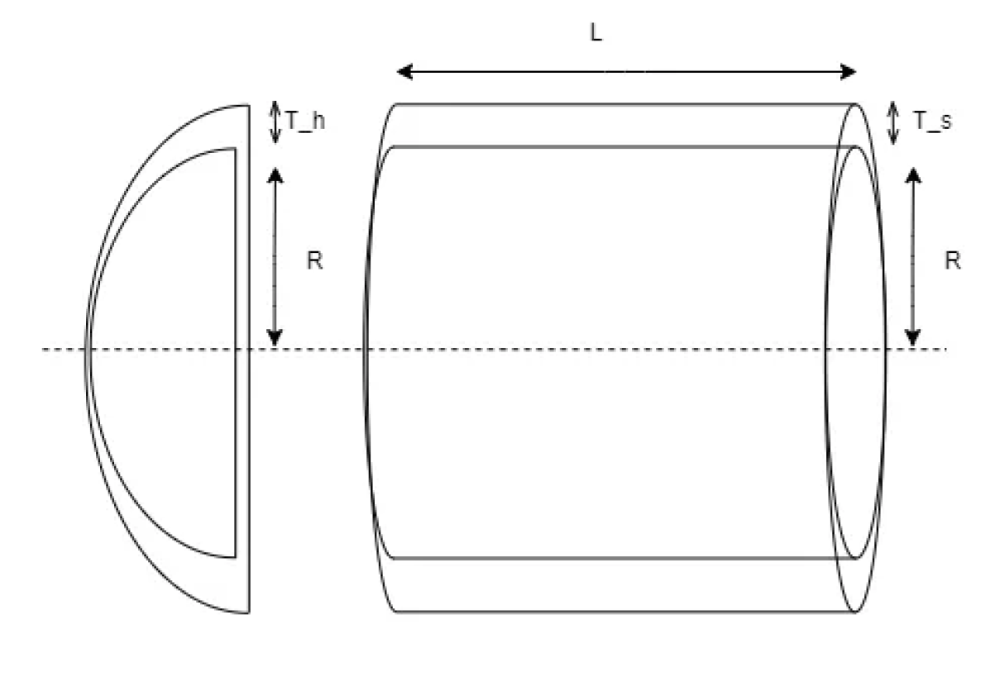

# Vessel Design Optimization using Evolution Strategies

## Introduction

This project presents an exploration of optimization strategies, focusing on the application of 
Evolution Strategies (ESs) to the minimization or maximization of multivariate functions. In our 
case, we will be dealing with a Constrained Non-Linear Pressure Vessel Design Problem, which 
aims at minimizing the cost of the material by optimizing the design variables of the vessel. 
However, absolute minimization cannot be achieved as some constraints are needed to be met 
to uphold the safety, efficacy, and physics of the vessel. 
The study involves comparing the performance of ESs considering factors such as execution time, 
the number of generations, fitness function calls, and the algorithm's success rate.  

The task involves optimizing the design of a compressed air storage tank, which operates at a 
working pressure of 2000 psi and has a maximum capacity of 750 cubic feet. This tank is designed 
in a cylindrical shape with hemispherical ends, as depicted in Figure 1. The primary goal is to 
reduce the overall cost, which encompasses the expenses for materials, shaping, and welding. 
The design involves four key variables: the thickness of the vessel's wall (Ts = x1), the thickness 
of the ends (Th = x2), the inner radius of the cylinder (R = x3), and the length of the cylindrical 
section excluding the ends (L = x4). These variables are represented in inches and are collectively 
denoted as X = (Ts, Th, R, L) = (x1, x2, x3, x4). 

<!--  -->

<!-- Adjust size and center image -->

  

minimize
$$
f(x) = 0.6224x_1x_3x_4 + 1.7781x_2x_3^2 + 3.1661x_1^2x_4 + 19.84x_1^2x_3
$$

subject to:
$$
g_1(x) = -x_1 + 0.0193x_3 \leq 0, \\
g_2(x) = -x_2 + 0.00954x_3 \leq 0, \\
g_3(x) = -\pi x_3^2x_4 - \frac{4}{3}\pi x_3^3 + 1296000 \leq 0, \\
g_4(x) = x_4 - 240 \leq 0 \\
$$

The problem domain is the compact $[0.0625, 6.1875]\times[0.0625, 6.1875]\times[10, 200]\times[10, 200]$. 
The Weierstrass Extreme Value Theorem states that a continuous function on a compact set 
attains its maximum and minimum values. Given that $f$ is a continuous (polynomial) function, 
and the domain is compact (closed and bounded in $\mathbb{𝑅}^4$), it is true that f will attain global optima (both maxima and minima) within this space. However, it's important to note that this theorem 
doesn't specify the location of these optima or whether they are unique.

## Evolution Strategies
For this problem we will proceed using an approach of the (μ, λ)-Gaussian Evolutionary Strategies algorithm, which consists in taking a population and iteratively evolving it through the application of mutation and recombination operations. However, our evolution method will only use mutation and not crossover to generate offspring, as we are interested in evolving the behaviour of individuals. With the appropriate parameters, this algorithm can find a balance between exploration and exploitation, enhancing the diversity of the population while focusing on promising solutions. Going through a dynamic interplay of mutation, and selection mechanisms, (μ, λ) algorithm aims to navigate the solution space effectively to optimize the given objective.

# Implementation
The following code has to be run from root folder in the project. The paths are relative to this location.

## Environment setup + run code
1. Developed on Visual Studio Code using Conda environment + Python 3.8
2. Generate env: `python -m venv env/`
3. Activate environment: 
    - Linux/Mac: `source env/bin/activate`
    - Windows: `env\Scripts\activate.bat`
4. Install requirements: `pip install -r requirements.txt`
5. Run experiments with fixed hyperparameters: `python evolution_strategies_deap.py --mu 1000 --lambda_ 1000 --mutpb 0.8 --ngen 50 --elitism_ratio 0.1 --tournament_size 10 --n_experiments 3`
6. Output will be saved in `output/` folder
7. Results are saved in `output/results.csv` file
8. The progress involving population offspring over generations of the best experiment (minimum fitness value inidividual) is seralized in `output/logbook.pkl` file, which can be loaded using `pickle.load(file)`

# Parameters
- `--mu`: Number of individuals in the population
- `--lambda_`: Number of offspring generated in each generation
- `--mutpb`: Mutation probability
- `--ngen`: Number of generations
- `--elitism_ratio`: Ratio of individuals to be selected for the next generation (elitism)
- `--tournament_size`: Size of the tournament for selection
- `--n_experiments`: Number of experiments to run
 